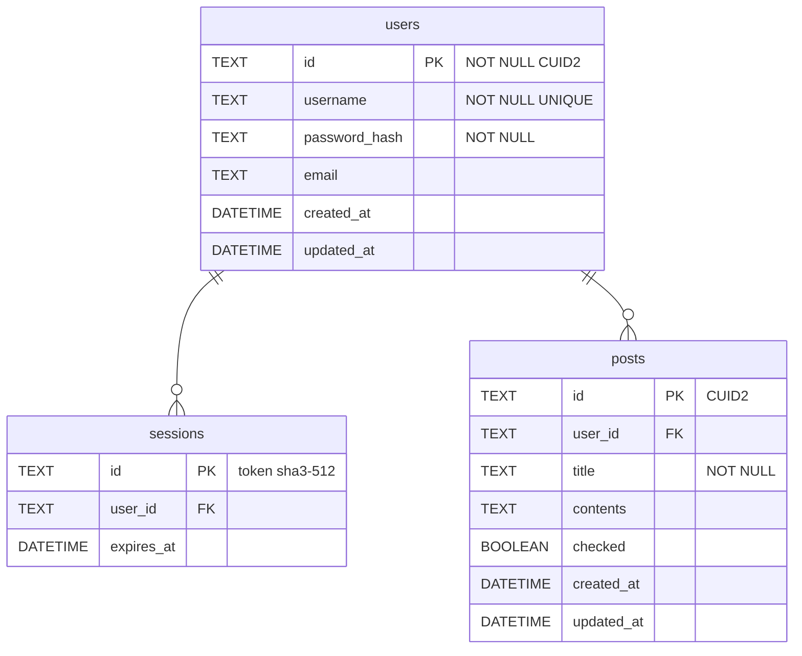

# ERD

```mermaid

erDiagram
  users {
    TEXT id PK "NOT NULL CUID2"
    TEXT username "NOT NULL UNIQUE"
    TEXT password_hash "NOT NULL"
    TEXT email
    DATETIME created_at
    DATETIME updated_at
  }
  sessions {
    TEXT id PK "token sha3-512"
    TEXT user_id FK
    DATETIME expires_at
  }
  posts {
    TEXT id PK "CUID2"
    TEXT user_id FK
    TEXT title "NOT NULL"
    TEXT contents
    BOOLEAN checked
    DATETIME created_at
    DATETIME updated_at
  }
  users ||--o{ sessions : ""
  users ||--o{ posts : ""

```
